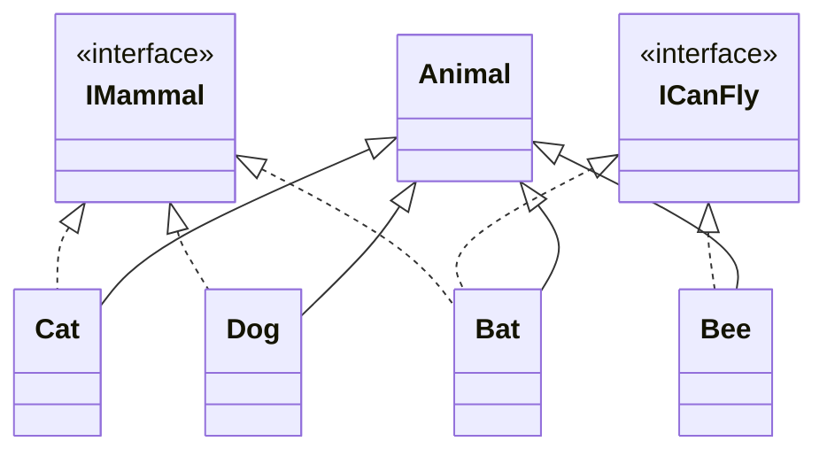

```mermaid
classDiagram

    class IMammal {
        <<interface>>
    }

    
    class ICanFly {
        <<interface>>
    }

    class Animal
    
    class Dog
    class Cat
    class Bat
    class Bee

    IMammal <|.. Cat
    IMammal <|.. Dog
    IMammal <|.. Bat

    ICanFly <|.. Bat
    ICanFly <|.. Bee

    
    Animal <|-- Bat
    Animal <|-- Bee
    Animal <|-- Cat
    Animal <|-- Dog

```